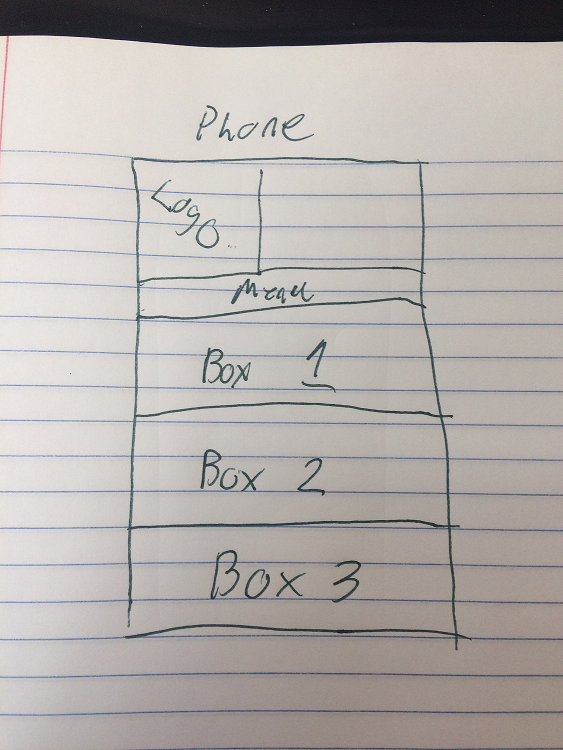

# Content
   *This pages content aims to deliver a very basic information on what Responsive Web Design is.
    
    *I decided to go with a basic blue color scheme, going from dark blue to a lighter blue. I think it looks okay, but A black type didn't look great on the dark blue, so I changed the type to white.
    
   *I didn't have as many problems with this assignment as I did with last weeks, I sent it to the Issues forum, and to Nick to give it a look and see if I was on the right track. So, thank-you to everyone who helped.
   
---

# My Mobile tyle

  I wanted it to be simple and easy, so my plan was to just have the site function the same way on other devices. Like So: 
  
  
  
  So thats it, I hope this is good, I want to mess around more with flexboxes on the final.
